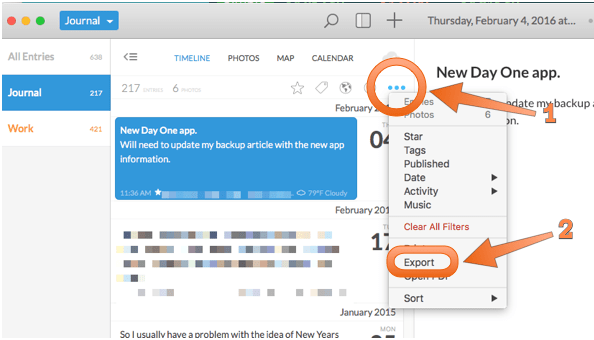

I have (several) times in my life lost data, which is a sterile, emotionless way of saying I've lost photos, documents, music, and contact information that _I could never recover or replace_. Over the last several years I have started putting systems in place to preventing this from happening again.

Part of the impetus for this article is that I not only wanted to go through all of my backups, but I wanted to document them, so I could refer to them later if I needed to. I hope all the thinking and documenting I've gone into here will help other people generate their own backup plans.

<!--more-->

## Foundations

My setup that needs to be covered by backups is:

* 2012 Retina MacBook Pro
* iPhone 6
* iPad Air
* Synology DS413j Network Attached Storage (NAS)

My (possibly excessive) backup regimen was built from the following rules:

1. Data should not live in one place. My house should be able to burn down and I don't lose data. Likewise, my offsite backup provider should be able to suffer a catastrophic fault and I don't lose all my backups.
2. My computer should be able to die and I should be back up and running with a basic setup within 1 day, even if I have to buy a new computer and start from scratch.
3. Any application I use should be able to be corrupted and non-replaceable and I don't lose data. For example, I use Paprika for managing my recipes. The Paprika application should be able to become corrupted and I can't download a new copy of it ever again and I should still be able to (somehow) access my recipes.
4. Any online service I use should be able to be shut down at a moment's notice and I do not lose all of my data.

To meet these requirements I break my backups into Primary backups covering whole devices and Secondary backups covering apps and services.

## Primary Backups: Devices

The first line of defense are on- and offsite backups. For my computer onsite backups I use Time Machine and SuperDuper!. For computer offsite backups I use CrashPlan. iOS devices are handled though iCloud and local encrypted backups.

### Time Machine

[Time Machine](https://support.apple.com/en-us/HT201250) is one of the greatest, unsung things Apple has ever released. The ease of setting up a backup for a user's computer that they don't have to think about is phenomenal. For most people, it is as simple as plugging in an external USB drive and turning it on. If you work off a laptop, a [Time Capsule](http://www.apple.com/ca/airport-time-capsule/) is probably a better bet so you don't have to remember to plug in a USB drive[^fnTimeMachine].

My Time Machine is configured to backup to my [Synology DS413j NAS](http://www.amazon.com/Synology-DiskStation-Diskless-Network-Attached/dp/B008U69LC4). Synology has [great instructions](https://www.synology.com/en-global/knowledgebase/DSM/tutorial/Backup_Restore/How_to_back_up_files_from_Mac_to_Synology_NAS_with_Time_Machine) on how to set this up.

There are two folders that I don't include in my backup set for Time Machine though:

1. Projects: this is where I keep all the programming source code I write. That folder contains tens, if not hundreds, of thousands of small text files which change frequently and I would prefer not to copy all of those changes to my backup. Source code is still backed up and is covered in Secondary Backups below.
2. iTunes music (`~/Music/iTunes/iTunes Music/`): this is excluded from the back for a similar reason. I collect and listen to a lot of music, only a fraction of which resides on my laptop at any one time. I keep the [canonical](http://dictionary.reference.com/browse/canonical) collection of my music on the Synology and prefer to merge changes to my iTunes library into that collection manually (or with the help of [Chronosync](http://www.econtechnologies.com/chronosync/overview.html)). Note the I _do_ backup the main iTunes directory, because I want to save my `iTunes Music Library.xml` file that keeps all of my play counts and ratings.

### SuperDuper!

Time Machine is a great background backup, but true peace of mind comes from my [SuperDuper!](http://www.shirt-pocket.com/SuperDuper/SuperDuperDescription.html) backup. SuperDuper! creates a whole-disk copy of my computer that I can boot from if things go horribly, horribly wrong.

I create my SuperDuper! backups weekly so that if I have to restore from it I don't miss too much data. You can set SuperDuper up to run on a schedule and keep the drive connected to your machine, but I prefer to have my SuperDuper copy in secure place when not actively backing up my machine.

### CrashPlan

Where Time Machine is the my "set it and forget" onsite backup, [CrashPlan](http://www.code42.com/crashplan/) is the same thing for off site backup. Though there are some [great alternatives](https://www.backblaze.com/) to CrashPlan I went with them for two reasons:

1. CrashPlan backups up my Synology without having to connect it via iSCSI or some other weird setup. This does cause problems if I lose connection with my Synology between backups (when that happens, CrashPlan has to rescan the Synology), but its worth it to me.
2. Though it doesn't appear to do so now, CrashPlan supported a "seed drive" option where they shipped you a hard drive that you could do your initial backup to and then ship back to them. This saved me a _ton_ of time backing up several hundred gigabytes of music and videos. If this sounds like something you need, try contacting their customer support and see if they still provide this service.

### iOS Backups

My iOS devices (iPhone and iPad) are set up with [iCloud Backup](https://www.apple.com/support/icloud/backup-storage/). For a long time I didn't have any problems, but I started to get "No Available Space" errors when backing up my iPhone so I finally signed up for iCloud's smallest storage level ($1/month for 50GB).

I also do backups to my laptop via iTunes every week _before_ I make my SuperDuper clone so that they are included in that backup. The local backups are set as [Encrypted Backups](https://support.apple.com/en-us/HT205220) so that passwords, wifi settings, etc. are kept if I need to restore. If you go this route, make sure you put the encryption password in your password manager (i.e. 1Password).

### A Note on Dropbox

[Dropbox](https://dropbox.com) is great. I use it to sync data between several machines and access data from my iOS devices. Dropbox is my preferred method of syncing data between iOS and my computer and I'll take it over iCloud any day.

However: **Dropbox is not backup.** Though it can be used for it in a pinch, Dropbox is designed as a synchronization system.

## Secondary Backups: Apps and Services

I also use many online services and I have made it a point to back up my data from them on a monthly cycle. The backups from these services are then fed into my normal backup system.

I am also a bit paranoid about my data getting locked up inside an app/program I can no longer run (due to a bug, version upgrade, data corruption, etc.), so I also try to backup my data from those apps.

The apps and services below are ordered alphabetically by task. The backups I generate from these apps and services are stored in a "Backups" folder[^fnBackupFolder] on my Synology (which is then backed up by CrashPlan for offsite storage).

### Automotive Fuel and Maintenance: Road Trip

I use [Road Trip](http://darrensoft.ca/roadtrip/) for tracking fuel and repair expenses for my car. You will need to have Dropbox sync enabled in the app before doing these steps. I have Road Trip set up to sync to the `Apps/RoadTrip/` folder in Dropbox. If you choose a different directory, you will need to change the path accordingly in step 4.

1. Press the [hamburger button](https://en.wikipedia.org/wiki/Hamburger_button) in the upper left corner
2. At the bottom tap Dropbox Sync
3. Tap the Export to CSV
4. Go to you dropbox folder and look in `Apps/RoadTrip/iPhone/Exported CSV Files/`.
5. You will have 1 CSV for each vehicle you track in Road Trip.
6. You can (for that extra sense of paranoia) also tap "Backup to Dropbox". You will find the exported `.roadtrip` files in `Apps/RoadTrip/iPhone/Current Backup/`
7. I rename the `iPhone` folder to RoadTip and then move it to my Backup folder. Once there I compress the RoadTrip folder to a zip file.

### Bookmarks: Pinboard

I use [Pinboard](https://pinboard.in) to save all of the links I want to look at later (whether "later" is 2 hours or 2 decades). I also happily pay the $25/year for an archiving account.

Log into the Pinboard website and go to the [backup page of your settings](https://pinboard.in/settings/backup). Save the [JSON](https://pinboard.in/export/format:json/) and/or [HTML](https://pinboard.in/export/format:html/) (whichever you feel more comfortable with).

### Email: Gmail

I use [gmvault](http://gmvault.org) to backup my Gmail. I have a regular process[^fnLaunchd] that runs `gmvault sync -t quick {myemail}` to keep it up to sync every 15 minutes. During my monthly backup I archive[^fnGmailTar] up the gmvault folder and move the archive to my backup folder.

### GitHub Stars: GitHub

[GitHub](https://github.com) has a feature called [stars](https://help.github.com/articles/about-stars/) to track repositories you are interested in. I [wrote a small utility](https://github.com/gubler/starGatherer) to export my list of starred repositories to an HTML file, which I then copy to the backup folder.

### Journaling: Day One

I use [Day One](http://dayoneapp.com/) to keep two journals (a personal one and one for work). Though I should use them a lot more than I should. While I was writing this article [Day One 2 was released](https://www.macstories.net/reviews/day-one-2-review/).

I decided to upgrade to the new version because it had some features that I wanted but I will give backup information for both versions here.

#### Day One Classic (v1)

In the Day One app, go to File -> Export and select the format you prefer (I use Markdown). I also copy the original `.dayone` files from where they are stored on Dropbox. The `.dayone` files are folders full of [`plist`](https://en.wikipedia.org/wiki/Property_list) files and photos and I feel comfortable doing text processing on them if I want to hunt for stuff.

Why backup both the `.dayone` _and_ markdown exports then? For the simple reason that at any time, Day One could change their file format to something that I can not open up and dig through.

Once I have both the `.dayone` file and the markdown export in a my backup folder, I compress them into a zip file.

#### Day One 2

The biggest drawback for Day One 2 is that the only sync method the developer's [Day One Sync platform](http://dayoneapp.com/sync/). You can still export from the app though, and that's what I am doing.

The [documentation on the Day One site](http://help.dayoneapp.com/exporting-entries/) on how to export still references Day One Classic. If you follow the directions and click `File -> Export` you are only given the options for PDF or Plain Text in Zip. PDF is a problem if you need to reimport later so Plain Text it is.

Digging into the exported zip file reveals two things. First, there is only one text file. I have two journals set up (one of the biggest draws of Day One 2 was multiple journals in one app), and both journals are mashed together into the export. The second is that the exported text file is really a markdown file. Just change the extension to `.md` and you are good to go.

The merging of the two journals is unacceptable though. After some more experimentation, I found out you can export a single journal by clicking the three dots above the journal's time line (first arrow in screenshot below) and then clicking Export (second arrow). The exported journal (still going with Plain Text as Zip) will be most recent to oldest entries, but at least it is a single journal. Do this for each of your journals, and copy the files to your backup folder.

##### The Full Geek

I did more poking and found where Day One 2 is storing it's data locally. I would strongly advise against modifying these files directly and you probably will not be able to do any kind of restore from them, but if you want to be paranoid in your backups and keep the highest fidelity backup of your data you will have to do some digging.

In your home directory there is a `Library` folder that is hidden by default[^fnShowLibrary]. Once inside you will find a `Group Containers` folder that contains many of subfolders. Look for a subfolder that ends in `.dayoneapp2` and inside of there should be `Data` and `Library` folders. Your entries are stored in a SQLite database in the `Data\Documents` folder, but its probably wise to archive the whole `.dayoneapp2` folder[^fnDayOneTar].

### Math: Soulver

[Soulver](http://www.acqualia.com/soulver/ios/) is a great app for doing any math more complicated than a single calculation in the Calculator app. Soulver is set to automatically sync its documents through Dropbox and I copy its sync folder to the Backup folder.

### Money Management: YNAB

This one is a problem for me...

[YNAB](http://www.youneedabudget.com/) is a budgeting system that I _like_. It makes sense to me. YNAB new version 5 changed from being an application on my local computer with its data in Dropbox into an online only service. I dislike that the new version is online only and I can't see any way to easily backup my data from the service to my local machine. The [Nerds on Draft podcast](http://www.nerdsondraft.com/podcast/2016/1/2/episode-057-perpetual-and-ynab-5) has a great episode on YNAB 5 and the problems with it.

I haven't decided yet what I'm going to do, but in the interim, I am displeased, uncomfortable, and have a gaping hole in my backup system.

### Notebook: Quiver

[Quiver](http://happenapps.com/#quiver) is a notebook designed for programmers. I use it to keep snippets of code, development and design notes, and deployment guides. Backup is done very easy by going to Preferences -> Backup and saving the exported `.qvlibrary`[^fnQuiver] to the backup folder.

You can also go to Preferences → Advanced and export your Quiver settings as a JSON file to the backup folder.

### Notes: Drafts/Editorial/nvAlt

The native Notes app got a boost in iOS 9, I don't like that its data is all stored in iCloud, where I don't control it. Instead, I take quick notes using [Drafts](https://agiletortoise.com/drafts/). Drafts has the same problem that all of its notes and settings are stored in iCloud. To mitigate this, nothing I write stays in Drafts.

My main app for text on iOS is [Editorial](http://www.omz-software.de/editorial/), which syncs to Dropbox. Most of the time I use an Action in Drafts that sends the text to Editorial. If you want to use this action, you can find it in the Drafts Action Directory [at this link](https://drafts4-actions.agiletortoise.com/a/1fq).

On my computer I use [nvAlt](http://brettterpstra.com/projects/nvalt/) which uses the same folder on Dropbox as Editorial so I can easily access all of my text files on all devices. The folder they read contains lots of individual text files, one for each note.

To backup this mass of text files, I run a command[^fnNotesTar] to archive my note files to the backup folder.

### Passwords: 1Password

Unlike the other sites and apps in the document, I have no plan if [1Password](https://agilebits.com/onepassword) vanishes. I'm _screwed_. However, I don't trust my 1Password data to the single location its stored in.

1Password automatically keeps its own backups, but I will grab the latest one each month and copy it off with the rest of my backups. To do this from 1Password on your Mac:

1. Go to Preferences
2. Go to "Backup"
3. Click the "Backup Now" button on the lower right
4. Click the "Show Files" button in the lower left. This will open Finder to where the backup files are being stored.
5. Scroll to the bottom of the list of backup files - this should be the one you just created.
6. Copy that to your backup folder.

1Password also gets an extra level of backup. I keep a backup of my 1Password database, an [encrypted disk image](https://support.apple.com/en-us/HT201599) of personal documents, and a filled-out copy of the [1Password Emergency Kit](https://blog.agilebits.com/2014/12/10/1password-emergency-kit-3-0/) on a USB drive that is kept at a secure, offsite location. This copy is an "in case of emergency" copy for my family. If I die or something else incapacitates me, this copy will allow my family to get into 1Password and through that into pretty much anything else. Updating it is part of my backup routine to make sure it doesn't get too far out of date and become obsolete.

### Photos: Photo Stream / Photos for Mac

Photos I take from my iPhone are uploaded to Photo Stream automatically and then Photos on my Mac downloads them (also automatically). Once they are on my computer, they are caught by the Primary Backups (Time Machine, SuperDuper and CrashPlan) automatically.

I don't quite trust Apple's Photos app to not corrupt itself though. So I also sync my iPhoto library to my NAS during my monthly backup. The backup doesn't go into the normal backup folder as everything else, but to a separate Photos  folder.

### Podcasts: Overcast

For podcasts I use [Overcast](http://overcast.fm). Though there is an online portal for Overcast, you can not download a list of all your podcasts from it. To get your list of podcast subscriptions, you need to:

1. Go to settings in the Overcast app
2. Tap on the "Export OPML" near the bottom of the screen
    * You can also take a second to see how many hours SmartSpeed has saved you at the bottom of the screen.
3. Overcast will pop up a share sheet and you can use that to either email the OPML file to yourself or upload directly to Dropbox if you have that option configured.
4. Once the file has been email/uploaded, move it to your backup folder.

### Reading: Instapaper

I use [Instapaper](https://www.instapaper.com/) to stash all of the articles I come across that I want to read later.

Go to your [settings page](https://www.instapaper.com/user) and near the bottom of the page are buttons (that look like links) to export everything as either HTML or CSV. Download the file and move it to your backup folder.

### Recipes: Paprika

I am an avid home cook and I keep my recipes in [Paprika](http://paprikaapp.com/).

There are two backups to create for Paprika:

1. File → Export and choose the HTML export. This makes sure you can access all of your recipes if the Paprika app goes away. This creates a pile of HTML files, which you'll need to compress into an easy to backup zip file.
2. File → Backup → Create Backup. This backup is easy to restore all of your recipes into a new copy of Paprika. This creates a `.paprikabak` file. This file is a zip file that contains all of the images for your recipes, an SQLite database of your data, and couple of temporary files for the SQLite database.

I create both of these in the backup folder in a "Paprika Recipes" subfolder and then compress the folder into a zip file.

### RSS Feed Aggregation: FeedWrangler

Many people have moved to Twitter/Facebook/etc. but I still use RSS feeds for my news. My aggregator of choice is [FeedWrangler](https://feedwrangler.net) (though I use several different apps for _reading_ my feeds).

Go to the [Manage Feeds](https://feedwrangler.net/feeds) page, scroll to the bottom, and click the [Export as OPML](https://feedwrangler.net/feeds/export.xml) link.

The file at is downloaded is `FeedWranglerOPML.xml`, which I rename to `FeedWrangler.opml` and then move to my backup folder.

### RSS Feed Generation: Feeder

For [my podcast](http://facet.fm) I manually generate the RSS feed, and to do that I use [Feeder](https://reinventedsoftware.com/feeder/).

Go to File -> Export and select the format as "Self Contained Feed". This exports a `.frfeed` file.

I go with this option because you can open by the exported file by right-clicking and clicking "Show Package Contents" (on non-Macs it will appear as a folder you can open). Inside is `feed.xml` which is the same file you get if you exported as an XML file.

Once save the `.frfeed` file to my backup folder I compress it to a zip file.

### Scanning from iOS: Scanbot

I set up [Scanbot](https://scanbot.io/en/index.html)'s **Automatic Upload** to push scans to Dropbox so that they do not remain on my phone where they can be lost if something happens to the device and I don't have to remember to export them.

Scans are normally moved to their proper place after they are created. During my monthly backup I go through my scans folder and process any that were missed.

### Source Code: GitLab

As mentioned above, I don't backup my source code via Time Machine. I leave that to [GitLab](https://about.gitlab.com/). I keep all of my code under version control with [git](http://git-scm.com/) and push my code to a remote GitLab instance I run on [DigitalOcean](https://m.do.co/c/106dd76ea952) (that's a referral link - if you sign up I get some credit). I also have DigitalOcean doing a backup of the machine I run GitLab off of.

Finally, I set up a git server[^fnSynologyGit] on my Synology that I also sync to for that extra redundancy.

### Task Management: OmniFocus

I use [OmniFocus](https://www.omnigroup.com/omnifocus) for task management. Its workflow, device syncing, and interface work well for me. However, my natural paranoia about leaving my data in an application that could become unavailable still makes me want a way of exporting all of my content out of it.

After some research I found [ofexport2](https://github.com/psidnell/ofexport2). The project has great documentation and since it is a command line application I can script it. It is a Java application though, so you will need to install Java to run it.

I export my OmniFocus data to a [Taskpaper](http://www.taskpaper.com/) file[^fnOmniFocusExport] in my backup folder. I can then open that file in [SublimeText 3](http://www.sublimetext.com/3) with the [PlainTasks](https://github.com/aziz/PlainTasks) plugin.

### Writing: Scrivener/SublimeText

Most of my long-form writing is documentation or training guides. Those are stored as plain text files (formatted in either [markdown](https://daringfireball.net/projects/markdown/) or [reStructuredText](http://docutils.sourceforge.net/docs/user/rst/quickref.html)) and are part of a project's source code. That means they are in git repositories and are backed up that way. Even this blog is done in markdown and is stored in a git repositories.

I also use [Scrivener](https://www.literatureandlatte.com/scrivener.php) for larger writing projects. I keep the Scrivener files in a folder on Dropbox and that folder is a part of my Primary backups (Time Machine, CrashPlan, and SuperDuper).

## Remembering to Backup

Backups are only useful if they are created and then updated regularly. Time Machine, CrashPlan, and iCloud are great in that you set them up once and they run in the background without you having to think about them. For everything else, I generate as tasks in a "Backup" project in OmniFocus.

For backing up my iOS devices and running SuperDuper I have a tasks that recurs weekly on Saturdays. For everything else, I create a tasks that recur on the first of the Month. I also have a monthly task to look for new apps or services and add them to the backup process.

## Automating the Backup

Even _better_ than going through my OmniFocus tasks and doing the backups manually would be automating the process. There is a big problem with this since iOS apps like Overcast and Road Trip can't be scripted to generate their backups monthly.

But hey, Automate What You Can, right?

I am in the process of going through all of these backups and starting to build a scripts to automate the backup generation where I can. As those scripts get built, they will get added to [my .dotfiles repository](https://github.com/gubler/dotfiles) on GitHub.

## Wrapping Up

I still have some holes to patch in my backups (1Password and YNAB) so more research and planning is in order there. I need to work on automating what backups I can.

If you don't have any backups set up, please start _somewhere_. Even if its just a free Dropbox plan that you put your most critical things into so you don't lose everything if your computer dies, gets stolen or destroyed. Sign up for CrashPlan or Backblaze if you can afford it so you have a solid offsite backup.

You don't need to have a plan as detailed or extensive as what I have, but _please has something_. Losing photos or documents that are irreplaceable is horrible and a little bit of effort and thought to prevent it is worth it.

[^fnTimeMachine]: Time Capsules are fairly expensive for what you get though. It might be better to look into building a cheaper alternative if you are the type to do so or a better alternative ([a full-blown NAS](http://thewirecutter.com/reviews/best-network-attached-storage/)) if you are willing to spend some cash.

[^fnBackupFolder]: _Technically_ the backups are in a `Backups/[year]-[month]` folder and I keep several months of backups.

[^fnLaunchd]: The process is a launchd User Agent (it only runs when I'm logged in). The .plist file for the job can be [found in my .dotfile repository on GitHub](https://github.com/gubler/dotfiles/blob/master/reference/local.gmvault.plist).

[^fnGmailTar]: Archiving the folder is done with the following command: `tar czf {backup folder}/gmail.tgz {gmvault-db folder}`. Example: If my backup folder is called MonthlyBackup in my home directory and the gmvault-db folder is in my home folder as well, the command would be `tar czf ~/MonthlyBackup/gmail.tgz ~/gmvault-db`.

> Edit 2016-02-13: Grammar and spelling corrections.

[^fnShowLibrary]: [Here's how to show the Library folder](http://osxdaily.com/2014/12/16/show-user-library-folder-os-x-yosemite/).

[^fnDayOneTar]: `tar czvf {backup folder}/dayone2.tgz ~/Library/Group\ Containers/*.dayoneapp2` will archive the folder regardless of the random characters preceding `.dayoneapp2`.

[^fnQuiver]: The `.qvlibrary` file is a [package](https://en.wikipedia.org/wiki/Package_(OS_X)) that contains sub-packages (`.qvnotebook`) full of JSON files.

[^fnNotesTar]: Pretty much the same as the command for gmvault: `tar czf {backup folder}/notes.tgz {notes folder}`.

[^fnSynologyGit]: Which was _not easy_. I followed a couple of how-tos and joined them together in [this gist](https://gist.github.com/gubler/4e7b35c95d77e48eec8c).

[^fnOmniFocusExport]: The command I use is `of2 -tx completed -o ~/{backup folder}/omnifocus.taskpaper` which exports all non-completed tasks.
