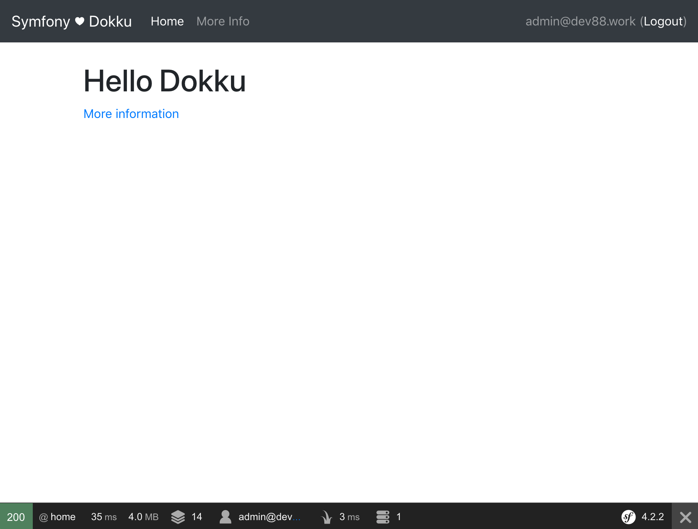

In this part we are going to add a _little_ style to our app. We will use [Symfony Encore](https://symfony.com/doc/current/frontend.html) to build our front end CSS and JS and then update our Dokku configuration to build our front end during deployment.

<!--more-->

## Create an Encore Branch

Just like last time, we will create a new branch to build our changes in:

```
git checkout -b encore
```

## Installing Encore

{}
Like the documentation says, you will need at _least_ [NodeJS](https://nodejs.org/) installed on your system. Though the documentation also recommends [yarn](https://yarnpkg.com/), I am more of an [NPM](https://www.npmjs.com/) person and will be using that.
{}

Installing Encore is done with following commands:

```bash
composer req encore
npm install
```
{}
We will be using [SASS](https://sass-lang.com/) for CSS pre-processing. To get SASS to work, we need to follow [the instructions in the Encore documentation](https://symfony.com/doc/current/frontend/encore/css-preprocessors.html).

First we uncomment `.enableSassLoader()` in the `webpack.config.js` file and then we need to install the SASS requirements. Run Encore and it will output a bunch of errors. Scroll to the top of the errors and you will see something like:

```bash
Error: Install sass-loader & node-sass to use enableSassLoader()
    npm install sass-loader@^7.0.1 node-sass --save-dev
```

Run that npm command to install the SASS dependencies.
{}

After everything is installed, we need to convert our CSS to SASS. First, rename `assets/css/app.css` to `assets/css/app.scss`. Next, edit `assets/js/app.js` to and change `require('../css/app.css');` to `require('../css/app.scss');`.

Now we can run `npx encore dev` to build three files, `runtime.js`, `app.css`, and `app.js`.

{}
`npm` manages packages but doesn't make life easy _executing_ any. `npx` is a tool for executing packages. When executables are installed via `npm` packages, `npm` links to them and then you can run them with `npx`.

You could also run Encore with `node_modules/.bin/encore dev`, but I find `npx encore dev` nicer.
{}

To use the generated files, we need to include them in our app's `tempates/base.html.twig` layout ([following the directions in the documentation](https://symfony.com/doc/current/frontend/encore/simple-example.html)):

```twig
<!DOCTYPE html>
<html>
    <head>
        <meta charset="UTF-8">
        <title>Welcome!</title>
        
            {{ encore_entry_link_tags('app') }}
        
    </head>
    <body>
        
        
            {{ encore_entry_script_tags('app') }}
        
    </body>
</html>
```

Once we have added `encore_entry_link_tags` and `encore_entry_script_tags` to our layout, we can fire up our app with `sf server:run` and we should now see our site has a grey background.

## Adding Bootstrap

The quickest way to add some basic style to our site is with [Bootstrap](https://getbootstrap.com). Luckily, [the documentation has us covered](https://symfony.com/doc/current/frontend/encore/bootstrap.html) and we will just follow those instructions to get Bootstrap set up.

{}
The documentation uses yarn. The command to install Bootstrap (and jQuery and Popper.js) with NPM is:

```bash
npm install bootstrap jquery popper.js --save-dev
```
{}

For styling our pages, we will use [the most generic bootstrap layout](https://getbootstrap.com/docs/4.2/examples/starter-template/). For this we need to update our CSS, JS, and layout.

Update our styles in `assets/css/app.scss`:

```sass
@import "~bootstrap/scss/bootstrap";

body {
    padding-top: 5rem;
}
```

Update our Javascript in `assets/js/app.js`:

```js
require('../css/app.scss');

const $ = require('jquery');
require('bootstrap');
```

And finally update our layout in `templates/layout.html.twig`:

```twig
<!doctype html>
<html lang="en">
<head>
    <meta charset="utf-8">
    <meta name="viewport" content="width=device-width, initial-scale=1, shrink-to-fit=no">
    <title>Symfony ♥ Dokku</title>
    
        {{ encore_entry_link_tags('app') }}
    
</head>
<body>
<nav class="navbar navbar-expand-md navbar-dark bg-dark fixed-top">
    <a class="navbar-brand" href="#">Symfony ♥ Dokku</a>
    <button class="navbar-toggler" type="button" data-toggle="collapse" data-target="#navbarsExampleDefault" aria-controls="navbarsExampleDefault" aria-expanded="false" aria-label="Toggle navigation">
        <span class="navbar-toggler-icon"></span>
    </button>

    <div class="collapse navbar-collapse" id="navbarsExampleDefault">
        <ul class="navbar-nav mr-auto">
            <li class="nav-item active">
                <a class="nav-link" href="{{ path('home') }}">Home</a>
            </li>
            <li class="nav-item">
                <a class="nav-link" href="{{ path('more_info') }}">More Info</a>
            </li>
        </ul>
    </div>
</nav>

<main role="main" class="container">
    
</main><!-- /.container -->

    {{ encore_entry_script_tags('app') }}

</body>
</html>
```

Run `npx encore dev`, restart our server, and reload our browser and we should see a plain, yet utterly functional webpage.



If everything is working right, we should commit everything to our repository:

```bash
git add .
git commit -m "Add Encore and basic styles"
```

## Building the Front End in Production

Our application currently is built using the PHP buildpack when we push to Dokku. The PHP buildpack does not include NodeJS, so we need to tell Dokku to also include the NodeJS buildpack. To do this, we add a `.buildpacks` file to the root of our app:

```
https://github.com/heroku/heroku-buildpack-nodejs
https://github.com/heroku/heroku-buildpack-php
```

The NodeJS buildpack will install all of our Encore dependencies - but does not install dev dependencies. We need to update our `package.json` file and change `devDependencies` to `dependencies`.

Finally, to run the `encore` command, we need to add a script to our `composer.json`:

```json
{
    //...
    "scripts": {
        // ...
        "post-update-cmd": [
            "@auto-scripts"
        ],
        "compile": [
            "node_modules/.bin/encore production"
        ]
    },
    //...
}

```

Just those three changes and we can commit all of our changes to our repository:

```bash
git add .
git commit -m "Add NodeJS and run Encore on Dokku"
```

That finishes up everything we need for this feature so we can merge this branch back into `master` and we are ready to push our changes up to Dokku:

```bash
git checkout master
git merge encore
git branch -D encore
git push origin dokku
```

The deployment to Dokku will take a little while. Once the deployment finishes, visit your site and it should have the all-new design.

## SUCCESS!

Everything is looking better and we have Encore building our front-end assets.

{}
In the next post in this series we set up a database and add Users with the ability to log in and out.
{}
