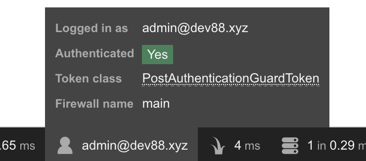

Now that we have a running application, we need to add a database (because... databases). For this tutorial, we will use the database to add authentication to our application using Symfony's MakerBundle.

<!--more-->

{}
This series is about getting Symfony working on Dokku - not creating production ready code. Use what we build here as a base for building your own applications, but do not use this code as-is.
{}

## Installing MariaDB on Dokku

{}
This post covers [MariaDB](https://mariadb.org/), but you can [PostgreSQL](https://www.postgresql.org/), [MySQL](https://www.mysql.com/), or [any other platform Doctrine supports](https://www.doctrine-project.org/projects/doctrine-dbal/en/2.9/reference/platforms.html#platforms). When deciding what database platform to use, take a look at [Dokku's GitHub](https://github.com/dokku) for the different database plugins the Dokku provides.
{}

To install the [MariaDB plugin](https://github.com/dokku/dokku-mariadb) we on the server we need to SSH into the Dokku server and run the following command:

```bash
sudo dokku plugin:install https://github.com/dokku/dokku-mariadb.git mariadb
```

That is all we need to do on the server. Back on our development computer, we need to create the database and link it to our app:

```bash
dokku mariadb:create sf-demo-db
dokku mariadb:link sf-demo-db sf-demo
```

## Create a New Branch for Development

Before we start working on this feature, we need to create a new branch and switch to it:

```bash
git checkout -b add_users
```

## Configuring the Development Database

We are using MariaDB on the server, so we have a couple of options on our local computer. We can

1. Install MariaDB on our local machine
2. Use databases in [Vagrant VMs](https://vagrantup.com) or [Docker containers](https://www.docker.com/).
3. Use a SQLite database.

You probably know what's best for you and this article is not the place for that topic. Whichever you go with, make sure you create a `.env.local` file in the root of your app and add the following:

```
DATABASE_URL=<your database connection information>
```

## Database Migrations

We are going to manage our database tables with [Doctrine Migrations](https://www.doctrine-project.org/projects/doctrine-migrations/en/2.0/index.html).

### Adding Migration 0

This is _completely optional_, but it is something I do. Though Doctrine's migrations _do_ support a `migrate first` command, they do not support a "rebuild" or similar command. This means the `down` method on your first migration can never be run. The only option you have is to drop and re-create the _entire_ database if you want to rebuild your database from scratch (which you may want to frequently for development or testing).

Create a new migration file `src/Migrations/Version20010101000000.php` with the content:

```php
<?php declare(strict_types=1);

namespace DoctrineMigrations;

use Doctrine\DBAL\Schema\Schema;
use Doctrine\Migrations\AbstractMigration;

/**
 * Empty starting migration
 */
final class Version20010101000000 extends AbstractMigration
{
    public function getDescription(): string
    {
        return 'Empty starting migration';
    }

    public function up(Schema $schema) : void
    {
    }

    public function down(Schema $schema) : void
    {
    }
}
```

With this migration in place, we can now run `sf doctrine:migrations:first` and roll all the way back to an empty database.

{}
Aliases are a great way to save extra typing. For example, we aliased `bin/console` to `sf`. Another alias I use is:

```bash
alias db-reset="bin/console doctrine:migrations:migrate first && bin/console doctrine:migrations:migrate"
```

If I am also using [Doctrine Fixtures](https://symfony.com/doc/current/bundles/DoctrineFixturesBundle/index.html), I change the alias to:

```bash
alias db-reset="bin/console doctrine:migrations:migrate first -n && bin/console doctrine:migrations:migrate -n && bin/console doctrine:fixtures:load -n"
```
{}

## Scaffolding Authentication

Symfony makes it fairly easy with the MakerBundle to add a basic User entity and authentication. We can then build out the generated code into what meets our needs.

### The User Entity

First we need to create a User entity, which we will do following the instructions in the [Symfony documentation](https://symfony.com/doc/current/security.html).

{}
If you are asked if you want to use Argon2i for password hashing, **select no**.

I have had problems with getting Argon2 password hashing working with the Dokku PHP image. Because of this, we are going to use bcrypt in our configuration.
{}

Run the `make:user` generator and use the following answers:

```plain
sf make:user

    The name of the security user class (e.g. User) [User]:
    > User

    Do you want to store user data in the database (via Doctrine)? (yes/no) [yes]:
    > yes

    Enter a property name that will be the unique "display" name for the user (e.g.
    email, username, uuid [email]
    > email

    Does this app need to hash/check user passwords? (yes/no) [yes]:
    > yes

    The newer Argon2i password hasher requires PHP 7.2, libsodium or paragonie/sodium_compat. Your system DOES support this algorithm.
    You should use Argon2i unless your production system will not support it.

    Use Argon2i as your password hasher (bcrypt will be used otherwise)? (yes/no) [yes]:
    > no
```

This will generate our `User` entity, repository, and update our `security.yaml` configuration file.

### The Authentication System

Scaffolding the login authentication we will also lift [directly from Symfony's documentation](https://symfony.com/doc/current/security/form_login_setup.html), using the `make:auth` command with the following answers:

```plain
sf make:auth

    What style of authentication do you want? [Empty authenticator]:
     [0] Empty authenticator
     [1] Login form authenticator
    > 1

    The class name of the authenticator to create (e.g. AppCustomAuthenticator):
    > LoginFormAuthenticator

    Choose a name for the controller class (e.g. SecurityController) [SecurityController]:
    > SecurityController
```

After the generator creates the authentication files, we need to update the `App\Security\LoginFormAuthenticator::onAuthenticationSuccess()` method (in `src/Security/LoginFormAuthenticator.php`, around line 89).

```php
// Replace:
   throw new \Exception('TODO: provide a valid redirect inside '.__FILE__);
// with
   return new RedirectResponse($this->urlGenerator->generate('home'));
```

### Migrating a User Table

Though there _is_ a `make:migration` command, we will not use it. The migration it creates is filled with database platform-specific code. If we ever want to change database server (MariaDB to PostgreSQL) or even use SQLite for running PHPUnit tests, the migrations would fail. Instead, we will create a migration that be run independent of platform.

Instead, we will use the DoctrineMigrationBundle's `doctrine:migrations:generate` command to create an empty migration and then update it with our migration code. First, generate the migration:

```plain
sf doctrine:migrations:generate
```

And the content for the generated migration:

{}
The migration I generated was `src/Migrations/Version20190203003048.php` and so the class name is `Version20190203003048`.

When using the code below, make sure to the class name generated for your migration. If you just copy and paste, you will get an error.
{}

```php
<?php declare(strict_types=1);

namespace DoctrineMigrations;

use Doctrine\DBAL\Schema\Schema;
use Doctrine\Migrations\AbstractMigration;

/**
 * Create Starting User Table
 */
final class Version20190203003048 extends AbstractMigration
{
    public function getDescription() : string
    {
        return 'Starting User Table';
    }

    public function up(Schema $schema) : void
    {
        $users = $schema->createTable('user');
        $users->addColumn('id', 'integer', ['autoincrement' => true]);
        $users->addColumn('email', 'string');
        $users->addColumn('roles', 'text');
        $users->addColumn('password', 'string');
        $users->setPrimaryKey(['id']);
        $users->addUniqueIndex(['email']);
    }

    public function down(Schema $schema) : void
    {
        $schema->dropTable('user');
    }
}
```

We can now migrate our database and create our user table:

```bash
sf doctrine:migrations:migrate
```

## Add User Command

Building out an entire user registration system will be the focus of a later post in this series. Instead, we will add a [console command](https://symfony.com/doc/current/console.html) to add users manually. This will also be useful for adding our first admin user to the system. The MakerBundle has a generator for console commands and we will use it with the following answers:

```plain
sf make:command

    Choose a command name:
    > app:add-user
```

Open the new `src/Command/AddUserCommand.php` file and replace the boilerplate with the following:

```php
<?php declare(strict_types=1);

namespace App\Command;

use App\Entity\User;
use Doctrine\ORM\EntityManagerInterface;
use Symfony\Component\Console\Command\Command;
use Symfony\Component\Console\Input\InputArgument;
use Symfony\Component\Console\Input\InputInterface;
use Symfony\Component\Console\Input\InputOption;
use Symfony\Component\Console\Output\OutputInterface;
use Symfony\Component\Console\Style\SymfonyStyle;
use Symfony\Component\Security\Core\Encoder\UserPasswordEncoderInterface;

/**
 * Manually add user to the system.
 */
final class AddUserCommand extends Command
{
    protected static $defaultName = 'app:add-user';
    /** @var UserPasswordEncoderInterface */
    protected $passwordEncoder;
    /** @var EntityManagerInterface */
    protected $entityManager;

    public function __construct(UserPasswordEncoderInterface $passwordEncoder, EntityManagerInterface $entityManager, string $name = null)
    {
        $this->passwordEncoder = $passwordEncoder;
        $this->entityManager = $entityManager;
        parent::__construct($name);
    }

    protected function configure(): void
    {
        $this
            ->setDescription('Add a user')
            ->addArgument('email', InputArgument::REQUIRED, 'Email Address')
            ->addArgument('password', InputArgument::OPTIONAL, 'Password - if empty a random password will be generated.')
            ->addOption('admin', 'a', InputOption::VALUE_NONE, 'Set the user as an admin.')
        ;
    }

    protected function execute(InputInterface $input, OutputInterface $output)
    {
        $io = new SymfonyStyle($input, $output);
        $email = $input->getArgument('email');
        $password = $input->getArgument('password') ?: \sha1(microtime());
        $roles = ['ROLE_USER'];
        if ($input->getOption('admin')) {
            $roles[] = 'ROLE_ADMIN';
        }

        $user = new User();
        $user->setEmail($email);
        $user->setPassword($this->passwordEncoder->encodePassword($user, $password));
        $user->setRoles($roles);

        try {
            $this->entityManager->persist($user);
            $this->entityManager->flush();

            $io->success('User Added!');

            $io->table(
                ['Field', 'Info'],
                [
                    ['ID', $user->getId()],
                    ['email', $user->getEmail()],
                    ['password', $password],
                    ['roles', implode(', ', $user->getRoles())],
                ]
            );
        } catch (\Exception $exception) {
            $io->error('Could not Create User!');
            $io->error($exception->getMessage());
        }

    }
}

```

We can now run `sf app:add-user -h` and see the information for our new command.

### Adding Our First User

{}
This command is being run locally and the information is for test users. We will run this command later on the server to create our own admin account in the live application.
{}

Run our command to create an admin user. The first argument (`admin@dev88.xyz`) is the email address and the second (`testtest`) is the password. The `-a` makes the user an admin.

```bash
sf app:add-user admin@dev88.xyz testtest -a

    [OK] User Added!

    ---------- -----------------------
    Field      Info
    ---------- -----------------------
    ID         1
    email      admin@dev88.xyz
    password   testtest
    roles      ROLE_USER, ROLE_ADMIN
    ---------- -----------------------
```

## Logging In

The `make:auth` generator created a login page at `templates/security/login.html.twig`. We can clean this table up to look a little nicer.

```twig


Log in!


<div class="row">
    <div class="col-sm-6 offset-3 text-center">
        <form method="post">
            
                <div class="alert alert-danger">{{ error.messageKey|trans(error.messageData, 'security') }}</div>
            

            <h1 class="h3 mb-3 font-weight-normal">Please sign in</h1>
            <label for="inputEmail" class="sr-only">Email</label>
            <input type="email" value="{{ last_username }}" name="email" id="inputEmail" class="form-control mb-2" placeholder="Email" required autofocus>
            <label for="inputPassword" class="sr-only">Password</label>
            <input type="password" name="password" id="inputPassword" class="form-control mb-2" placeholder="Password" required>

            <input type="hidden" name="_csrf_token"
                   value="{{ csrf_token('authenticate') }}"
            >

            <div class="checkbox mb-3">
                <label>
                    <input type="checkbox" name="_remember_me"> Remember me
                </label>
            </div>

            <button class="btn btn-lg btn-primary btn-block" type="submit">Sign in</button>
        </form>
    </div>
</div>

```

### Remembering the User

In the template above we included the "Remember Me" checkbox. For that to work, we need up update the `config/packages/security.yaml`:

```yaml
security:
    encoders:
        App\Entity\User:
            algorithm: bcrypt
    providers:
        app_user_provider:
            entity:
                class: App\Entity\User
                property: email
    firewalls:
        dev:
            pattern: ^/(_(profiler|wdt)|css|images|js)/
            security: false
        main:
            anonymous: true
            guard:
                authenticators:
                    - App\Security\LoginFormAuthenticator
            remember_me:
                secret:   '%kernel.secret%'
                lifetime: 604800 # 1 week in seconds
                path:     /

    access_control:
         - { path: ^/admin, roles: ROLE_ADMIN }
```

You can now visit http://localhost:8000/login (you will need to start the server with `sf server:run` if you had stopped it previously) and enter the username and password to log in your test admin user. You should see the test admin's information in the debug bar at the bottom of the page.



## Logging Out

Now that we can log in, we need a way to log out. First we need a route to our `config/routes.yaml` file:

```yaml
logout:
    path: /logout
```

{}
Instead of adding a route to our `config/routes.yaml` file, we could instead add a method to our `src/Controller/SecurityController.php`:

```php
    /**
     * @Route("/logout", name="logout")
     */
    public function logout()
    {
    }
```

The only benefit to this approach is if we need to do extra work when a user logs out (such as logging the event, or clear some generated files, etc.).
{}

Now we need to tell our security system how to handle logouts. In `config/packages/security.yaml` add the `logout` option and path to the `main` firewall:

```yaml
        main:
            anonymous: true
            guard:
                authenticators:
                    - App\Security\LoginFormAuthenticator
            remember_me:
                secret:   '%kernel.secret%'
                lifetime: 604800 # 1 week in seconds
                path:     /
            logout:
                path: logout
```

Now if you visit http://localhost:8000/logout, you should be logged out.

### Adding Links for Logging In and Out

Update our `templates/base.html.twig` layout with the following snippet:

```twig
<nav class="navbar navbar-expand-md navbar-dark bg-dark fixed-top">
    <a class="navbar-brand" href="#">Symfony ♥ Dokku</a>
    <button class="navbar-toggler" type="button" data-toggle="collapse" data-target="#navbarsExampleDefault" aria-controls="navbarsExampleDefault" aria-expanded="false" aria-label="Toggle navigation">
        <span class="navbar-toggler-icon"></span>
    </button>

    <div class="collapse navbar-collapse" id="navbarsExampleDefault">
        <ul class="navbar-nav mr-auto">
            <li class="nav-item active">
                <a class="nav-link" href="{{ path('home') }}">Home</a>
            </li>
            <li class="nav-item">
                <a class="nav-link" href="{{ path('more_info') }}">More Info</a>
            </li>
        </ul>

        <!-- LOGIN/LOGOUT LINKS -->
        <span class="navbar-text">
            
                {{ app.user.email }}
                (<a href="{{ path('logout') }}">Logout</a>)
            
                <a href="{{ path('app_login') }}">Login</a>
            
        </span>
    </div>
</nav>
```

Refresh your page and you should see a login link in the upper right. Clicking it should take you to the login page and once you log in, you should see your email address and a logout link instead.

Now to get back to some Dokku stuff.

### Pre- and post-deployment tasks

Next we will add an `app.json` file to the root of our app to use [Dokku's predeploy and postdeploy tasks](http://dokku.viewdocs.io/dokku/advanced-usage/deployment-tasks/). In our `app.json` file, we are going to add a predeploy task to migrate our database:

```json
{
    "scripts": {
        "dokku": {
            "predeploy": "php bin/console doctrine:migrations:migrate --allow-no-migration"
        }
    }
}
```

The `--allow-no-migration` is to prevent errors if we don't have any un-run migrations.

## Commit and Merge Our Updates

Before we deploy everything, we need to merge our work into `master`:

```bash
git add .
git commit -m 'Add Users, logging in, and logging out'
git checkout master
git merge add_users
git branch -D add_users
```

And finally we can push our changes up to Dokku:

```bash
git push dokku master
```

This will take a while to run, but when its done, we can add a new user.

## Adding User to the Live Site

To add a user, we are going to run our `app:add-user` command. This time, use _your_ email and a _secure_ password. The `dokku enter` command will log us into the application container on the server. Once in we can run the `app:add-user` command (we _do_ have to php bin/console because we do not have our alias) and then `exit` the server.

```plain
dokku enter
php bin/console app:add-user <your@email> <your-password> -a
exit
```

You should now be able to go to your demo site (for me, that is https://sf-demo.dev88.xyz) and log in with your username and password.

## SUCCESS!

We now have a site that we can log in and out of. That was a lot to get through, but it is the foundation we need to build out more features.

{}
Next we will handle uploading files and setting up persistent storage.
{}
