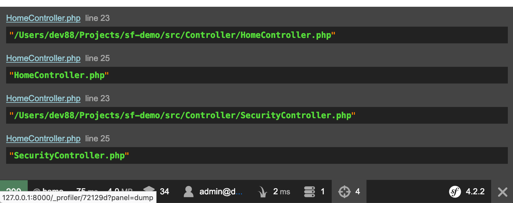
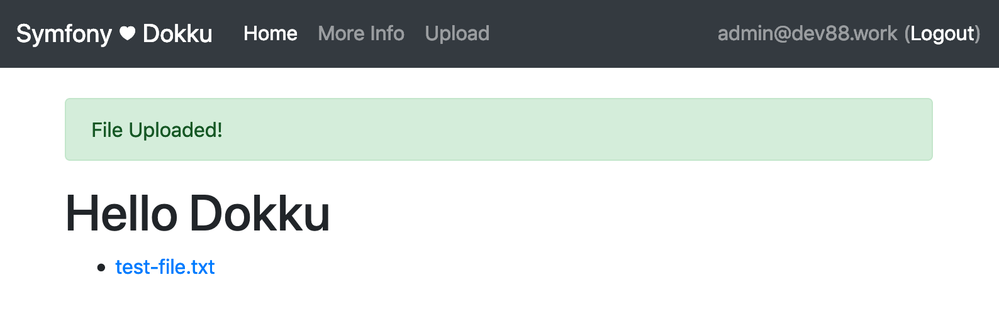

Lots of applications will need to handle file uploads. We _do_ have some storage on our Dokku server we can use. So let's use that storage to upload some files and learn how to use [Dokku's persistent storage](http://dokku.viewdocs.io/dokku/advanced-usage/persistent-storage/) with our Symfony application.

<!--more-->

{}
We are only covering storing files on the Dokku server. This is fine when our application is only working with a small amount of files or we are just experimenting.

If our application needs a lot of data storage, then you have two primary options:

1. Add extra storage to your Dokku server with [DigitalOcean Block Storage](https://www.digitalocean.com/products/block-storage/). Not the cheapest option, but simple and you just need to tweak these instructions.
1. Use an online storage providers like [DigitalOcean Spaces](https://www.digitalocean.com/products/spaces/), [Amazon S3](https://aws.amazon.com/s3/), [Backblaze B2](https://www.backblaze.com/b2/cloud-storage.html), or [something else](https://duckduckgo.com/?q=amazon+s3+alternatives).

There are many tutorials on how to integrate a storage provider with Symfony and bundles that can integrate your application with those storage providers[^oneup].
{}

[^oneup]: [OneupUploaderBundle](https://github.com/1up-lab/OneupUploaderBundle) has worked well for me in the past.

## Create a Branch to Work In

As always, we create a working branch for building our new feature.

```plain
git checkout -b uploading
```

## What We Are Building

{}
This example is about working with Dokku's persistent storage in our Symfony application. _Not_ about a robust and full featured file uploading experience. Use what we build here as a base for building your own applications, but do not use this code as-is.
{}

We are going add to the homepage a list of uploaded files that can be clicked and downloaded. If we are logged in, we will also show links to delete the files, and a form to upload new files.

## Where to Store Uploaded Files

Where we store our files may change between our development machine and the Dokku server. We will set up our development machine now to get uploads working and then make any necessary changes for the Dokku server later.

On our development machine, we will create an `uploads` directory in our `public` directory that we will store our uploaded files in.

{}
This setup will make our files accessible to _anyone_, whether they are logged into our system or not. People could even link to our files from other sites.
{}

### `.gitignore`-ing Uploads

We do not want to commit our uploaded files to our repository, so the first thing we need to do is add the uploads directory to our `.gitignore` file in the root of our application. Add this line to the top of the `.gitignore`[^gitignore] file:

```plain
/public/uploads
```

[^gitignore]: [gitignore documentation](https://git-scm.com/docs/gitignore)

## Listing Existing Files

To browse uploaded files, we need to install the [Symfony Finder component](https://symfony.com/doc/current/components/finder.html).

```plain
composer req finder
```

Now we can update the `index()` method of our `HomeController`. We will slightly modify the example from the Symfony documentation.

{}
You will also need to add `use Symfony\Component\VarDumper\VarDumper;` to the other `use` statements to the top of `HomeController`.
{}

```php
/**
 * @Route("/", name="home")
 */
public function index()
{
    $finder = new Finder();
    $finder->files()->in(__DIR__);

    foreach ($finder as $file) {
        // dumps the absolute path
        VarDumper::dump($file->getRealPath());
        // dumps the relative path to the file
        VarDumper::dump($file->getRelativePathname());
    }

    return $this->render('home/index.html.twig', [
        'finder' => $finder,
    ]);
}
```

Start up your server (`sf server:run`) and go to your homepage. In the profiler bar at the bottom of the page you should see that there are 4 dump statements and hovering over the icon you should see details similar to this:



We can see that `$finder->files()->in(__DIR__)` is searching in our `src/Controller` directory. To fix this, we will create a new parameter in `services.yaml` that points to the `uploads` directory and fetch it in the `HomeController`.

The second problem is we have not created a `public/uploads` directory. To handle that, we will test if the directory exists and if not, set `$finder` to an empty array.

{}
We do not want to commit the `public/uploads` to our repository. This makes sure that when we connect the persistent storage in Dokku later on, we do not run into any problems.

This also means that locally, we could run into a problem where we have checked out our application and the `uploads` directory does not exist yet. We are being careful and preparing for that situation.
{}

In `src/Controller/HomeController.php`:

```php
/**
 * @Route("/", name="home")
 */
public function index()
{
    $uploadsDir = $this->getParameter('uploads_directory');

    $finder = false === file_exists($uploadsDir)
        ? []
        : (new Finder())->files()->in($uploadsDir)
    ;

    return $this->render('home/index.html.twig', [
        'finder' => $finder,
    ]);
}
```

and in `config/services.yaml`:

```yaml
# ...
parameters:
    locale: 'en'
    uploads_directory: '%kernel.project_dir%/public/uploads'
```

Next we will update our `templates/home/index.html.twig` template to list the files.

```twig


Hello Dokku!


    <h1>Hello Dokku</h1>

    <ul>
        
            <li>
                <a href="uploads/{{ file.relativePathName }}">
                    {{ file.relativePathName }}
                </a>
            </li>
        
    </ul>

```

Going back to our homepage in the browser, we do not see any files listed, yet.

## Uploading Files

For adding files we need:

- a form to upload files
- an entity to pass to the upload form
- a method on the `HomeController` to handle the serving and processing the form
- a template to display the form
- a link to the form if the user is logged in

### The `Upload` Entity

To work with the form we will create shortly, we need to create an `Upload` entity. This will work as a [data transfer object](https://en.wikipedia.org/wiki/Data_transfer_object) instead of an entity we would persist to the database.

Create the file `src/Entity/Upload.php` with the contents:

```php
<?php

namespace App\Entity;

use Symfony\Component\HttpFoundation\File\UploadedFile;

final class Upload
{
    /** @var UploadedFile */
    public $file;
}
```

### The Form Class

We will then create a [form class](https://symfony.com/doc/current/forms.html#creating-form-classes) for our upload. Create the file `src/Form/UploadFileType.php` with the content:

```php
<?php

namespace App\Form;

use App\Entity\Upload;
use Symfony\Component\Form\AbstractType;
use Symfony\Component\Form\FormBuilderInterface;
use Symfony\Component\OptionsResolver\OptionsResolver;
use Symfony\Component\Form\Extension\Core\Type\FileType;

class UploadFileType extends AbstractType
{
    public function buildForm(FormBuilderInterface $builder, array $options): void
    {
        $builder
            ->add('file', FileType::class, ['label' => 'File to Upload'])
        ;
    }

    public function configureOptions(OptionsResolver $resolver): void
    {
        $resolver->setDefaults(['data_class' => Upload::class,]);
    }
}
```

### The `upload` Method

In our `HomeController` we will add an `upload` method to display and process the form:

```php
/**
 * @Route("/upload", name="upload")
 */
public function upload(Request $request)
{
    // reject users who are not logged in
    if (!$this->isGranted('IS_AUTHENTICATED_REMEMBERED')) {
        throw new AccessDeniedHttpException('You must be logged in to upload files.');
    }

    $upload = new Upload();
    $form = $this->createForm(UploadFileType::class, $upload);
    $form->handleRequest($request);
    if ($form->isSubmitted() && $form->isValid()) {
        $file = $upload->file;

        // simplistic filename sanitize
        $fileName = preg_replace('/[^\w\.]/','-', $file->getClientOriginalName());

        // Move the file to the directory where brochures are stored
        try {
            $file->move(
                $this->getParameter('uploads_directory'),
                $fileName
            );
            $this->addFlash('success', 'File Uploaded!');
        } catch (FileException $e) {
            throw $e;
        }

        return $this->redirectToRoute('home');
    }

    return $this->render('home/upload.html.twig', [
        'form' => $form->createView(),
    ]);
}
```

Some things to point out in this method are:

1. The check to make sure that the user is `USER_AUTHENTICATED_REMEMBERED`. This makes sure the user is logged in, either through 'remember me' cookie or from logging in (logging in would provide `USER_AUTHENTICATED_REMEMBERED` _and_ `USER_AUTHENTICATED_FULLY` - we just need to test for the former).
2. If the upload is valid, we rename the file by replacing all non-word or period characters with hyphens (using `preg_replace`). The actual renaming happens in the `$file->move` call.
3. There is a call to `$this->addFlash`. We will add a helper to display [flash messages](https://symfony.com/doc/current/components/http_foundation/sessions.html#flash-messages) when we update our `base.html.twig` layout in the next section.

### Templates and Layouts

We need a template to display the form and we need to update our layout file with a link to the upload form. We will also add a helper to display flash messages.

#### The Upload Form

Create the file `templates/home/upload.html.twig` and add the contents:

```twig


Upload a File!


    <h1>Upload a File</h1>

    {{ form_start(form) }}
        {{ form_row(form.file) }}

        <button type="submit" class="btn btn-primary">Upload!</button>
    {{ form_end(form) }}

```

{}
If you browse to this view now, it looks _horrible_. The form is not laid out properly at all. To fix this, we need to tell twig to use [the Bootstrap form theme](https://symfony.com/doc/current/form/bootstrap4.html).

Add the following to the `config/packages/twig.yaml` config file:

```yaml
twig:
    form_themes: ['bootstrap_4_layout.html.twig']
```

Now everything should look better.
{}

#### Update the Layout

We need to update our `templates/base.html.twig` layout and add a link to the upload form. We will add the link to the nav bar at the top of the page. We will also add a [twig `include`](https://twig.symfony.com/doc/2.x/tags/include.html) for `_helpers/flashes.html.twig` that will display any flashes we create.

```twig
<!doctype html>
<html lang="en">
<head>
    <meta charset="utf-8">
    <meta name="viewport" content="width=device-width, initial-scale=1, shrink-to-fit=no">
    <title>Symfony ♥ Dokku</title>
    
        {{ encore_entry_link_tags('app') }}
    
</head>
<body>
<nav class="navbar navbar-expand-md navbar-dark bg-dark fixed-top">
    <a class="navbar-brand" href="#">Symfony ♥ Dokku</a>
    <button class="navbar-toggler" type="button" data-toggle="collapse" data-target="#navbarsExampleDefault" aria-controls="navbarsExampleDefault" aria-expanded="false" aria-label="Toggle navigation">
        <span class="navbar-toggler-icon"></span>
    </button>

    <div class="collapse navbar-collapse" id="navbarsExampleDefault">
        <ul class="navbar-nav mr-auto">
            <li class="nav-item active">
                <a class="nav-link" href="{{ path('home') }}">Home</a>
            </li>
            <li class="nav-item">
                <a class="nav-link" href="{{ path('more_info') }}">More Info</a>
            </li>
            
                <li class="nav-item">
                    <a class="nav-link" href="{{ path('upload') }}">Upload</a>
                </li>
            
        </ul>

        <span class="navbar-text">
            
                {{ app.user.email }}
                (<a href="{{ path('logout') }}">Logout</a>)
            
                <a href="{{ path('app_login') }}">Login</a>
            
        </span>
    </div>
</nav>

<main role="main" class="container">
    

    
</main><!-- /.container -->

    {{ encore_entry_script_tags('app') }}

</body>
</html>
```

#### The Flashes Helper

We also need to add the `templates/_helpers/flashes.html.twig` file (and the `_helpers` directory). In the file we will put the contents:

```twig

    <div class="alert alert-danger">{{ flash }}</div>



    <div class="alert alert-warning">{{ flash }}</div>



    <div class="alert alert-success">{{ flash }}</div>



    <div class="alert alert-info">{{ flash }}</div>

```

## Testing Our Uploader

Visit the homepage and if you not logged in, log in to the application. We should now see an "Upload" link in the nav bar and clicking it will go to the upload form. Test uploading a file with the form. You should return to the homepage and see a link to the file you just uploaded. I uploaded a file named `test file.txt` and here is what I get:



Notice that the space in `test file` has been replaced with a `-`. Also, clicking on link will display the uploaded file. We also have the green `success` flash at the top of the content area.

Now if you log out, you will still see the uploaded file and be able to click the link. However, the link to the Upload form is no longer displayed in the nav bar and if you visit `/upload` you will get a `403 Access Denied` error (though, since we are on our local development machine, we will get a helpful Symfony Exception screen).

Everything works how we want it to. Now to delete that file.

## Deleting Files

To delete the files, we will add a link next to each file that will go to a `deleteUpload` method in out `HomeController`.

### The `deleteUpload` Method

The `deleteUpload` method will take the filename of the upload we want to delete and, if found, delete the file. If the file is not found, it will set an error flash. In either case it will forward us back to the `home` page. It should also check that we are logged in (like the `upload` method we just added). We will add the `deleteUpload` method to our `HomeController`:

```php
/**
 * @Route("/delete_upload/{filename}", name="delete_upload")
 */
public function deleteUpload(string $filename): RedirectResponse
{
    // reject users who are not logged in
    if (!$this->isGranted('IS_AUTHENTICATED_REMEMBERED')) {
        throw new AccessDeniedHttpException('You must be logged in to delete files.');
    }

    $uploadDir = $this->getParameter('uploads_directory');
    $file = $uploadDir.'/'.$filename;

    if (false === file_exists($file)) {
        $this->addFlash('error', 'File does not exist.');

        return $this->redirectToRoute('home');
    }

    if (unlink($file)) {
        $this->addFlash('success', 'File deleted.');

        return $this->redirectToRoute('home');
    }

    $this->addFlash('error', 'File could not be deleted.');

    return $this->redirectToRoute('home');
}
```

### Add the "Delete" Link

Next we will update the `templates/home/index.html.twig` view to include the "Delete" link:

```twig
<!-- ... -->
<ul>
    
        <li>
            <a href="uploads/{{ file.relativePathName }}">
                {{ file.relativePathName }}
            </a>
            
                <a href="{{ path('delete_upload', {'filename': file.relativePathName}) }}" class="btn btn-outline-danger btn-sm">
                    Delete
                </a>
            
        </li>
    
</ul>
<!-- ... -->
```

Now if we visit out homepage and we are logged in, we will see a "Delete" button next to each file. Clicking it will delete the file. If we are not logged in, we should not see the link, and even if we try to use the link and we are not logged in, we will get another `403 Access Denied` error.

## Commit Our Changes

We now have uploads working so we should commit our changes to the repository.

```plain
git add .
git commit -m 'Add uploading and deleting files.'
```

## Dokku Setup

To get our Dokku server set up to handle uploads we need to SSH into our server and create a directory to store our files.

{}
Remember to use your server name, not `dev88.xyz`.
{}


```plain
ssh root@dev88.xyz
mkdir -p /var/lib/dokku/data/storage/sf-demo/uploads
chown -R 32767:32767 /var/lib/dokku/data/storage/sf-demo
```

Now we need to tell Dokku to mount that folder into our application. Run this command on the server, too.

```plain
dokku storage:mount sf-demo /var/lib/dokku/data/storage/sf-demo/uploads:/app/public/uploads
```

The great thing is that we are mounting to the exact same place as our dev environment looks. So we do not need to change anything in our code.

{}
We are not limited to a single mount in our application. If needed, we could mount additional folders. For example, say we wanted a folder just to store user avatars. We could create the folder `/var/lib/dokku/data/storage/sf-demo/avatars` and then mount it to `public/avatars` with the command:

```plain
dokku storage:mount sf-demo /var/lib/dokku/data/storage/sf-demo/avatars:/app/public/avatars
```
{}


## Merge and Push

Now we can merge our development branch into `master` and push our updates to Dokku.

```plain
git checkout master
git merge uploading
git branch -D uploading
git push dokku master
```

Once everything finishes deploying, we can go to our site and make sure everything works.

## SUCCESS!

We now have a persistent storage that will keep our uploads between deployments.

{}
The next article will finish up by tackling several mini-topics.
{}
