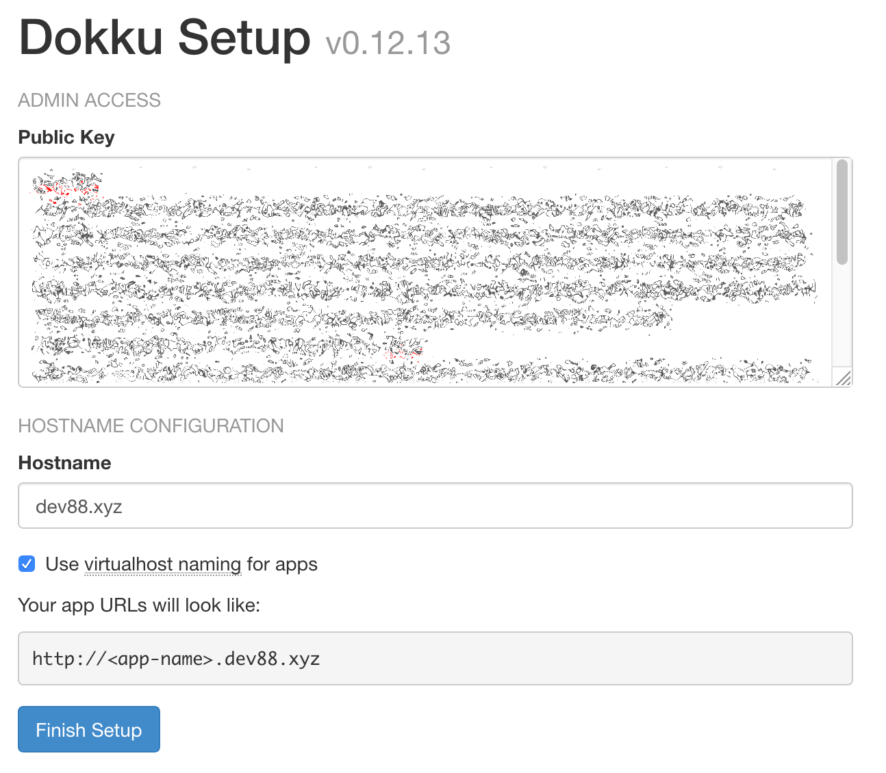

I have ideas all the time for small web applications. I suspect you do as well. These are the little tools - stuff for me and/or my friends. These applications will never make me any money, so I'm always put off a little on where to host them online. Heroku and similar _PaaS_ (Platform as a Service) providers will just be too expensive to run a bunch of little applications - especially with database and file hosting. Enter [Dokku](http://dokku.viewdocs.io/dokku/), a self-hosted PaaS.

In this tutorial, we are going to set up Dokku, and deploy a static HTML page to it as a test. [Dokku has good documentation doing a manual installation](http://dokku.viewdocs.io/dokku/getting-started/installation/), but to make it even easier, we are going to use [DigitalOcean's one-click install](https://www.digitalocean.com/products/one-click-apps/dokku/) to get everything up and running.

<!-- more -->

If you don't already have a DigitalOcean account, [you can sign up here with my affiliate link](https://m.do.co/c/106dd76ea952).

{}
Deploying to Dokku is done via [git](https://git-scm.com), and you will need to have SSH keys created. If you do not already have SSH keys created, [GitHub has great documentation on creating new keys](https://help.github.com/articles/generating-a-new-ssh-key-and-adding-it-to-the-ssh-agent/).
{}

## Load SSH Keys into DigitalOcean

First we need to add our **public** SSH key to DigitalOcean. This key will be loaded into our Dokku server so we can SSH into the server once it has been created.

1. Log into your DigitalOcean account.
1. [Go to the security settings for your account.](https://cloud.digitalocean.com/account/security)
1. Scroll down to SSH Keys and click the "Add SSH Key" button.
1. Copy the contents of your public SSH key into the form and give your key a name (if unsure, use the name of your computer so you know what computer the key is from).
    - if you are on macOS (and your public key is `id_rsa.pub`) you can use the command `cat ~/.ssh/id_rsa.pub | pbcopy` to copy your SSH key contents and then paste them into the form.
1. Click "Add SSH Key".

Once our key has been added we can create the new Dokku server.

## Adding a Domain Name

Also before creating the Dokku server, you will need a domain name for the server. Using a domain name will enable us to deploy future applications to subdomains.

To connect your domain name to Dokku, you need to configure your domain to use DigitalOcean's nameservers. The process for this will depend on registrar and you will need to check your registrar's support information on how to set the nameservers.

For reference, DigitalOcean's nameservers are:

- ns1.digitalocean.com
- ns2.digitalocean.com
- ns3.digitalocean.com

{}
For this tutorial, we will be using the domain name **dev88.xyz**. Make sure to change any commands or settings in this tutorial from dev88.xyz to your own domain name.
{}

{}
If you have just changed the nameservers for your domain name, it can take several hours for that change to be seen by your computer (and other computers).

- To see if your changes have propagated, [check DNSLookup.org](https://www.dnslookup.org/) - enter your domain name, select "NS" from the option and then click "Lookup". If you see DigitalOcean's nameservers listed, then propagation has mostly finished.
- You may still need to clear the local DNS cache on your computer. You can search how to how to flush your DNS cache for your operating system.
{}

## "One-Click" Dokku

To set up the new Dokku server [go to the new droplet page](https://cloud.digitalocean.com/droplets/new) and use the following settings:

- "Choose an image": click the "One-click apps tab" and select "Dokku 0.12.13 on 18.04" (you can also [use this link to go straight to that option](https://cloud.digitalocean.com/droplets/new?i=f31ea9&fleetUuid=1eb42f9a-2459-403a-9163-ff1a5e67c450&appId=38795781&type=applications&size=s-1vcpu-2gb&region=nyc1)).
- "Choose a Size": select the $10/month (1 CPU/2 GB RAM) option under "Standard Droplets". This is the minimum necessary for Dokku and a good starting size for experimentation. You may have to scale your server up in the future, but we can start small.
- "Add backups": If you will be using your Dokku server for _anything_ long-term and you can afford it, I _highly_ recommend you select Yes.
- "Add block storage": We do not need the added expense of block storage. Do not add any.
- "Choose a datacenter region": Select a datacenter close to you.
- "Select additional options": Leave these unchecked.
- "Add your SSH keys": click the checkbox next to the SSH key you added earlier.
- "Finalize and create"
    - "How many Droplets?": Leave this at 1.
    - "Choose a hostname": Change this to "Dokku" or another hostname that you will recognize.
- "Select project": Leave the default project.

Finally, click the "Create" button and wait for the droplet to be created.

{}
Dokku is installed by adding [PackageCloud](https://packagecloud.io/dokku/dokku) as an `apt` source. This means that `apt-get update && apt-get upgrade` will update Dokku (whenever PackageCloud has been updated, which is pretty often).

You should be doing package updates on your server on a regular basis to get bug fixes and security updates. If you want to be extra careful, you can [create a snapshop](https://www.digitalocean.com/docs/images/snapshots/) of your server before running the update. After you have completed the update and confirmed everything works then you can delete the snapshot.
{}


## Dokku Configuration

Once the droplet is created, copy the IP address and go to it with your browser.

{}
If you go to the IP address and get a 502 Bad Gateway error, wait ~5 minutes or so for the server to finish initializing.
{}

You should see a configuration form like this:



- "Public Key": Your SSH key should be pre-filled into the SSH Key textarea, but if not, copy the contents of your **public** SSH key into the form field.
- "Hostname": Enter your domain name (mine is `dev88.xyz`)
- "Use virtualhost naming for apps": Check this box.

Click "Finish Setup" and once Dokku finishes its configuration, you will be taken to the [Dokku documentation for Deploying to Dokku](http://dokku.viewdocs.io/dokku~v0.12.13/deployment/application-deployment/).

Before we deploy anything to Dokku, we need to do a few things.

## Connecting Our Domain Name

Back in your DigitalOcean dashboard, [go to Networking](https://cloud.digitalocean.com/networking/domains). Under "Add a domain" enter your domain name, change the project (if necessary), and then click "Add domain".

You will be taken to the configuration for your domain name. We now need to add two DNS records for the domain name. Both records will be "A" records.

1. For the root domain name:
    - "Hostname": `@`
    - "Will Direct To": Select your dokku server
    - "TTL": Leave the default
    - Click "Create Record"
1. Next we need a record for our subdomains:
    - "Hostname": `*`
    - "Will Direct To": Select your dokku server
    - "TTL": Leave the default
    - Click "Create Record"

Once we have created the DNS records we need to deploy a new application to Dokku.

## Deploying to Dokku

[Dokku's documentation](http://dokku.viewdocs.io/dokku/deployment/application-deployment/) uses a Ruby on Rails app for their tutorial, but that is more complex than we need. We are just going to deploy a single HTML webpage.

### Create a new Application

Before we can do anything we need to create a new application in Dokku.

1. SSH into your Dokku server: `ssh root@dev88.xyz`;
1. Create a `home` app with the following command: `dokku apps:create home`
1. Disconnect from the Dokku server using the `exit` command.

### Create the Web Page

Create a new directory on your drive and create an `index.html` file with following contents:

```html
<!DOCTYPE html>
<html>
<head>
    <title>Hello, Dokku</title>
</head>
<body>
    <h1>Hello, Dokku
</body>
</html>
```

### Give Dokku a Hint

To let Dokku know that our application is a static site, we need to add `.static` file. Dokku will see this file and know how to automatically configure the application for hosting. In the same directory as your `index.html` file run the following command:

```bash
touch .static
```

### Setup Git

Now we need to setup git for our application. Run the following commands in the same directory as our `index.html` file:

1. `git init` to initialize the repository.
1. `git remote add dokku dokku@dev88.xyz:home` will add our Dokku server as a git remote so we can deploy to it. **Make sure to use _your_ domain name instead of dev88.xyz**.
1. `git add . && git commit -m 'Initial commit'` will add our files to the git repository.
1. `git push dokku master` will push our application to Dokku.

Once we push our code to Dokku, we will see our application get configured and deployed. Once the push completes you should see:

```text
=====> Application deployed:
       http://home.dev88.xyz

To dev88.xyz:home
 * [new branch]      master -> master
```

You should now be able to browse to the URL under "Application deployed:" (http://home.dev88.xyz in the example above).

You should _also_ be able to your root URL (http://dev88.xyz) and see the same page. Dokku maps the first application that is created to the root address (without a subdomain).

## Adding SSL via Let's Encrypt

Dokku provides a [Let's Encrypt plugin](https://github.com/dokku/dokku-letsencrypt) to easily add SSL to our applications. SSH into your server (`ssh root@dev88.xyz`) and we can use the plugin to secure our application:

1. `dokku plugin:install https://github.com/dokku/dokku-letsencrypt.git` to install the plugin.
1. `dokku config:set --global DOKKU_LETSENCRYPT_EMAIL=your@email.tld` to configure email address to use for Let's Encrypt.
1. `dokku letsencrypt home` to add a certificate to our `home` app.

Once the certificate is issued, you should now be able to go to https://home.dev88.xyz and have a valid SSL certificate. If you go to the non-HTTPS version of the page (http://home.dev88.xyz) you should get forwarded to the HTTPS page. If we check https://dev88.xyz though we get an SSL error.

### A Broken Root

The reason for the SSL error is that our certificate is only valid for `home.dev88.xyz`. We need to add `dev88.xyz` to the certificate. Run these commands on the server:

1. `dokku domains:add home dev88.xyz` will tell Dokku to add the `dev88.xyz` to the `home` application. **Make sure to use _your_ domain name instead of dev88.xyz**.
1. `dokku letsencrypt home` will get a new certificate with updated domains.

Once the new certificate is issued, you should now be able to go to https://dev88.xyz and no longer have an error.

## Updating the SSL certificate

Let's Encrypt SSL certificates need to be updated on a regular basis. The developers of the Dokku plugin make this easy with the following command (run on the Dokku server):

```bash
dokku letsencrypt:cron-job --add
```

This command will add a cron job to automatically update our certificates.

{}
We now have a Dokku server up and running that we can add new applications to. Experiment with your new server! Build awesome stuff!

**What Next?**

Coming soon will be a series on deploying [Symfony](https://symfony.com) applications on Dokku. I am also hosting this blog on a Dokku server using [Hugo](https://gohugo.io) and I may do another series in the future documenting how I set that up as well.
{}
