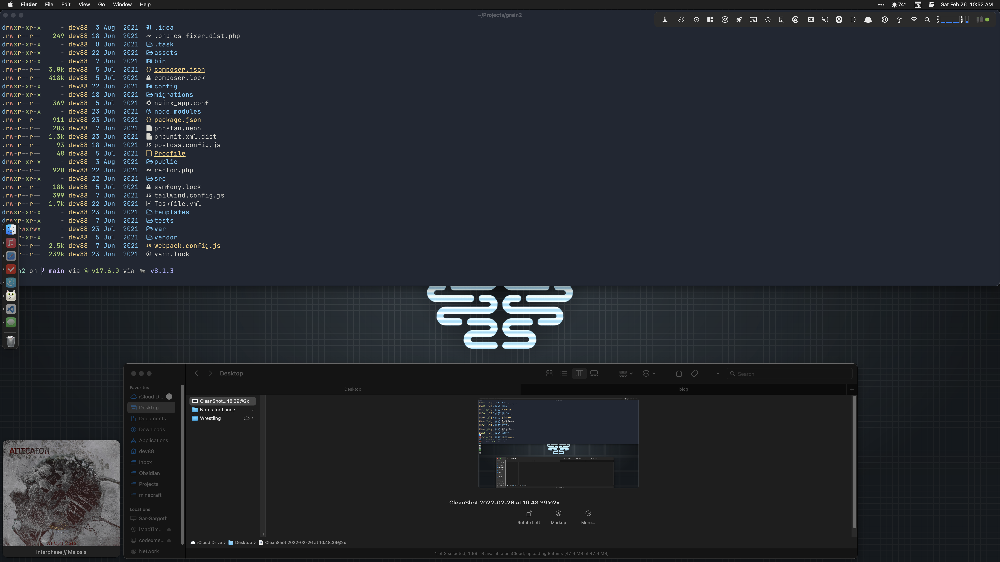

+++
title = "Uses"
description = "Hardware and Software I use"
date = "2021-12-01"
+++

This is a list of hardware, software, and tools I use at work and home.

I occasionally change things in my setups and this page will serve as a living document and a place to point people to when I get asked.

This is page is inspired by [uses.tech](https://uses.tech) by [Wes Bos](https://wesbos.com/).


Last updated: 2021-12-30


## Hardware

Personally, I have a lot of computing devices that I use in different contexts.

- My [iPhone 13 Pro (graphite, 256GB)](https://www.apple.com/iphone-13-pro/specs/) is pretty much always on me and I keep it in an [Apple Red Silicone Case](https://www.apple.com/shop/product/MM2L3ZM/A/iphone-13-pro-silicone-case-with-magsafe-productred) (which I only use because the leather cases this year have horrible colors). I also use the [Apple MagSage Leather Wallet](https://www.apple.com/shop/product/MHLR3/iphone-leather-wallet-with-magsafe-black).
    - For headphones I use either [AirPods Pro](https://www.apple.com/airpods-pro/) or [AirPods Max](https://www.apple.com/airpods-max/) (which, though expensive, I absolutely love).
- I wear an [red Apple Watch series 6 (44mm)](https://www.apple.com/shop/buy-watch/apple-watch?option.watch_cases=M02H3LL/A&option.watch_bands=MG463AM/A&preSelect=false&product=Z0YQ&step=detail) with a braided solo loop (either [(Product)Red](https://www.apple.com/shop/product/MY8Y2AM/A/44mm-productred-braided-solo-loop-size-6) or [Pride](https://www.apple.com/shop/product/MJXH3AM/A/44mm-pride-edition-braided-solo-loop-size-6))
- For reading and playing games, I use an [iPad mini (2021, 6th Generation, wi-fi, 64GB, Purple)](https://www.apple.com/ipad-mini/). I didn't like how pale the purple was so I got a [purple dbrand Skin](https://dbrand.com/shop/ipad-mini-6-skins) for the back. When I take the mini out of the house I put it in an [orange Smart Folio](https://www.apple.com/shop/product/MM6J3ZM/A/smart-folio-for-ipad-mini-6th-generation-electric-orange). I also occasionally use an [Apple Pencil (2nd Generation)](https://www.apple.com/shop/product/MU8F2AM/A/apple-pencil-2nd-generation).
- My [iPad Pro, 5th Generation (2021, 12.9-inch, WiFi, 256GB)](https://support.apple.com/kb/SP844?locale=en_US) is used for watching videos, infrequent writing, and some games that benefit from the large screen. This iPad Pro lives in a[Smart Keyboard Folio](https://www.apple.com/shop/product/MXNL2LL/A/smart-keyboard-folio-for-ipad-pro-129-inch-5th-generation-us-english).
- My laptop is an [M1 MacBook Air (2020)](https://www.apple.com/macbook-air/specs/) (with a [dbrand Red Carbon Fiber skin](https://dbrand.com/shop/apple-macbook-air-13-skins-2020-m1)). I got this to experiment with Apple silicon and as a couch/recliner computer.
- My main computer is a [2020 Intel 27" iMac](https://support.apple.com/kb/SP821?locale=en_US). The iMac is on an Amazon Basics VESA mount attached to [GeekDesk v1 standing desk](https://www.geekdesk.com/).
    - I use a [Microsoft Sculpt Ergonomic keyboard](https://www.microsoft.com/accessories/en-us/business/sculpt-ergonomic-keyboard-for-business/5kv-00001) and a [Logitech MX Master 2s](https://www.logitech.com/en-ph/product/mx-master-2s-flow) mouse.
    - I have a [Satechi Aluminum Type-C Clamp Hub](https://satechi.net/products/aluminum-type-c-clamp-hub-pro?variant=1465750552585) and [OWC Thunderbolt Hub](https://eshop.macsales.com/shop/owc-thunderbolt-hub) to add a bunch of ports to the iMac.
    - I back up my computer to a [Samsung T5 SSD](https://www.samsung.com/semiconductor/minisite/ssd/product/portable/t5/) for Time Machine and a pair of [SanDisk Extreme Portable SSDs](https://kb.sandisk.com/app/answers/detail/a_id/20670/~/sandisk-extreme-portable-ssd-support-information) for daily and weekly whole disk backups using Carbon Copy Cloner.
    - I also have BootCamp set up to dual boot into Windows 10 for gaming.
- I also have a custom-built Windows 10 computer connected to my TV for hosting Plex and playing some games.
- Finally, I have a [Synology DS-413j](https://global.download.synology.com/download/Document/Hardware/DataSheet/DiskStation/13-year/DS413j/enu/Synology_DS413j_Data_Sheet_enu.pdf) NAS for storing all kinds of files (and a lot of videos and music for my Plex server).
- I also have a [Rasberry Pi 4](https://www.raspberrypi.org/products/raspberry-pi-4-model-b/) that I experiment with and a [Raspberry Pi Zero running Pi-Hole](https://learn.adafruit.com/pi-hole-ad-blocker-with-pi-zero-w/overview-adafruit2).

## Software

#### Services

- I use [FastMail](https://ref.fm/u16733801) (referral link) for email, calendar, and contacts (which are all synced to macOS and iOS).
- iCloud Drive for file sync.
    - I have iCloud's "Desktop and Documents sync" feature enabled. This helps keep my iMac and MacBook Air in sync and also makes all of those files accessible on my iPads and iPhone.
- [1Password](https://1password.com/) for password management. If you aren't using a password manager, you really should start doing so.
    - I subscribe to [1Password for Families](https://1password.com/families/) to keep all my family safe(-er).
- RSS is handled by [FeedBin](https://feedbin.com) - I use RSS for most of my "web browsing".
- Music is handled by [Apple Music](https://www.apple.com/apple-music/) and [Plex](https://www.plex.tv/)

#### macOS

 

- I run my life with [OmniFocus](https://www.omnigroup.com/omnifocus/).
- [Alfred](https://www.alfredapp.com/) for launching apps and a bunch of other workflows.
- I am testing [Safari](https://www.apple.com/safari/) as my primary browser, but if it doesn't work out I'll go back to[Firefox](https://www.mozilla.org/firefox/) for my day-to-day browser.
- [Backblaze](https://www.backblaze.com/), [Carbon Copy Cloner](https://bombich.com/), and [Time Machine](https://en.wikipedia.org/wiki/Time_Machine_(macOS)) for backups.
- [VS Code](https://code.visualstudio.com/) for quick text editing.
- [Obsidian](https://obsidian.md/) for notes.
- [DEVONthink](https://www.devontechnologies.com/apps/devonthink/) for document storage.
- [BetterTouchTool](https://folivora.ai/), [Keyboard Maestro](https://www.keyboardmaestro.com/main/), [Hazel](https://www.noodlesoft.com/), and ShortCuts for automation.
- [Bartender](https://www.macbartender.com/) makes my menubar nicer.
- [Magnet](https://magnet.crowdcafe.com/) for window management.
- [Fantastical](https://flexibits.com/fantastical) for calendars.
- [Carrot Weather](http://www.meetcarrot.com/weather/) for weather.
- [TextExpander](https://smilesoftware.com/TextExpander) for fixing typos and text snippets.
- [CleanShot X](https://cleanshot.com/) for screenshots and quick recordings.
- [Rocket](https://matthewpalmer.net/rocket/) for emoji.
- [Calibre](https://calibre-ebook.com/) and [Apple Books](https://itunes.apple.com/us/app/ibooks/id364709193) for ebooks.
- [VLC](https://www.videolan.org/vlc/) for videos.
- [Day One](https://dayoneapp.com/) for journaling.
- [Acorn](https://flyingmeat.com/acorn/) and [Pixelmator Pro](https://www.pixelmator.com/pro/) for image editing.
- [Paprika Recipe Manager 3](http://www.paprikaapp.com/) for recipies.
- [Steam](https://store.steampowered.com/) for games.
- [Plex](https://www.plex.tv/) and [YouTube](https://www.youtube.com/) for video.
- Messages, [Slack](https://slack.com/), and [Discord](https://discordapp.com/) for communication.

##### Development Tools

- [PhpStorm](https://www.jetbrains.com/phpstorm/) for PHP code and [PyCharm](https://www.jetbrains.com/pycharm/) for Python code.
    - For my PHP code, I use the [Symfony](https://symfony.com) framework for speeding up development.
- [Dash](https://kapeli.com/dash) for documentation.
- [Docker](https://www.docker.com/community-edition) for containers.
- [Kitty](https://sw.kovidgoyal.net/kitty/) is my terminal of choice.
    - [ZSH](https://www.zsh.org/) (with [Oh My ZSH](https://ohmyz.sh/)) for my shell and [ShellHistory](https://loshadki.app/shellhistory/) for extended history shared between computers.
- [Kaleidoscope](https://kaleidoscope.app/) for diffing
- [Tower](https://www.git-tower.com/) or [LazyGit](https://github.com/jesseduffield/lazygit) for git/version control.
- [Transmit](https://www.panic.com/transmit/) for FTP.

#### iOS/iPadOS

I use a lot of the same apps on my mobile devices that I use on my Macs.

- [1Password](https://itunes.apple.com/us/app/1password/id568903335) for passwords (I disable iCloud Keychain).
- [OmniFocus](https://itunes.apple.com/us/app/omnifocus-3/id1346190318) for task management.
- [Day One](https://itunes.apple.com/us/app/day-one-journal/id1044867788) for journaling.
- [Fantastical](https://apps.apple.com/us/app/fantastical-calendar-tasks/id718043190) for calendars.
- [Carrot Weather](https://itunes.apple.com/us/app/carrot-weather/id961390574) for weather.
- [Shortcuts](https://itunes.apple.com/us/app/shortcuts/id915249334) for automation.
- Messages, [Slack](https://itunes.apple.com/us/app/slack/id618783545), and [Discord](https://apps.apple.com/us/app/discord/id985746746) for communication.
- Apple Music for music
    - [Marvis Pro](https://apps.apple.com/us/app/marvis-pro/id1447768809) is my main music app (for scrobbling to Last.fm)
    - And I like [Albums](https://apps.apple.com/us/app/albums-album-focused-player/id1469948986) as a different interface
    - I also use [Prism](https://itunes.apple.com/us/app/prism-music/id1335007451) for music from my Plex server.
for Apple Music.
- [Obsidian](https://apps.apple.com/us/app/obsidian-connected-notes/id1557175442) for notes.
- [DEVONTthink To Go](https://apps.apple.com/us/app/devonthink-to-go-3/id1541605051) for document storage.
- iCloud Drive for file sync.
- [Apple Books](https://itunes.apple.com/us/app/ibooks/id364709193) for ebooks, mainly because it syncs my books and reading location across all my devices. And that's for ePubs or PDFs.
- [Paprika 3](https://itunes.apple.com/us/app/paprika-recipe-manager-3/id1303222868) for Recipies

I also use:

- [Drafts](https://apps.apple.com/us/app/drafts/id1236254471) for starting text.
- [Due](https://itunes.apple.com/us/app/due-reminders-timers/id390017969) for timers.
- Safari for browsing.
- [Reeder](https://apps.apple.com/us/app/reeder-5/id1529445840) for RSS (with FeedBin as the backing service).
- [Pocket](https://apps.apple.com/us/app/pocket-save-read-grow/id309601447) for reading stuff later.
- [Lose It!](https://itunes.apple.com/us/app/lose-it-calorie-counter/id297368629) for calorie tracking.
- [YNAB](https://itunes.apple.com/us/app/ynab-you-need-a-budget/id1010865877) for money tracking.
- [Prologue](https://apps.apple.com/us/app/prologue/id1459223267) for audiobooks.
- [Overcast](https://itunes.apple.com/us/app/overcast/id888422857) for podcasts.
- [Scanner Pro](https://itunes.apple.com/us/app/scanner-pro/id333710667) for scanning.
- [Parcel](https://apps.apple.com/us/app/parcel-delivery-tracking/id375589283) for package tracking.
- [Streaks](https://itunes.apple.com/us/app/streaks/id963034692) for habit tracking.
- [Tweetbot](https://itunes.apple.com/us/app/tweetbot-6-for-twitter/id1527500834) for Twitter.
- [Narwhal](https://apps.apple.com/us/app/narwhal-for-reddit/id845422455) for Reddit.

## Work Hardware

At work I use a [16" 2019 MacBook Pro](https://support.apple.com/kb/SP809?viewlocale=en_US&locale=en_US). The laptop is connected to a [HP Z27s](https://support.hp.com/us-en/product/hp-z27s-27-inch-ips-uhd-display/7155485/product-info) and a [Logitech C920s web cam](https://www.logitech.com/en-us/products/webcams/c920s-pro-hd-webcam.960-001257.html).

I use a [Keychron K3 (color LEDs, Gateron Brown switches)](https://www.keychron.com/products/keychron-k3-wireless-mechanical-keyboard) keyboard and a [Logitech MX Master 2s](https://www.logitech.com/en-ph/product/mx-master-2s-flow) mouse which are connected to the laptop via an old HooToo HT-UH010 7-Port USB 3.0 Hub.

I recently got a [Fully Jarvis Standing Desk](https://www.fully.com/standing-desks/jarvis/jarvis-adjustable-height-desk-bamboo.html) and an [ErgoDriven Topo standing mat](https://ergodriven.com/products/topo?variant=27365321411) which I am getting used to. When I sit I use a [SteelCase Leap Plus](https://store.steelcase.com/seating/high-performance-seating/leap-plus).

My work issued me an [iPhone XR](https://support.apple.com/kb/SP781) which I barely use and it sits most of the time on an [Anker PowerWave Stand](https://www.anker.com/products/variant/powerwave-stand/A2524011).

### Work Software

Most of my development software is the same between work and personal.

The main difference between work and home is that at work I use Microsoft 365 apps, most notably:

- OneDrive for file backup/sync.
- Microsoft Edge for a browser.
- Teams for communication with my co-workers.
